# Assembly Guide

Assembly order:
1. Configure all motors (`docs/electronics/motor_commissioning.md`).
2. Print all STL parts (`docs/manufacturing/printing_guide.md`).
3. Build upper legs in order: `torso -> hips (left and right) -> thigh (left and right)`.
4. In parallel, build lower legs in order: `foot -> ankle -> knee_mechanism -> shin -> ankle_mechanism` (left and right).
5. Assemble upper and lower leg modules.
6. Integrate both legs to torso and run wiring checks.

Common assembly rules:
- For each subassembly, insert bearings first (press or gentle hammer).
- Place motor metal pin during the same phase as bearing insertion.
- Exception: in `knee_mechanism` and `ankle`, one interface should stay slightly loose but still movable.
- For subassembly pins: place them during assembly except on `thigh` (keep thigh demountable).
- Motor orientation is critical: follow the Onshape assembly orientation relative to each motor connector, otherwise cable length can become insufficient.
- Default thread strategy is direct screw in plastic; use around `5 Nm` for non-structural plastic threads.
- For motor threaded holes and structural insert zones, use higher torque appropriate to the thread/material.
- Some fits are intentionally tight; if required, gently ream/drill with a metal bit at low speed.
- Pins are not a standalone assembly stage: install them inside each motor/subassembly during build.
- Tools are prerequisites only (not assemblies).

Reference files:
- `hardware/bom/bom.csv`
- `hardware/bom/bom_buy.csv`
- `docs/manufacturing/printing_guide.md`
- `docs/electronics/motor_commissioning.md`
- `hardware/electronics/cabling/README.md`

Leg cabling note:
- Left and right legs use the same sub-cable design and routing logic.
- Cable legend: red = power, green = CAN, blue = CAN + power.

Leg cabling integration order (both legs):
1. Prepare three sub-cables using `hardware/electronics/cabling/README.md`: shin, thigh, hip pass-through.
2. Install the shin sub-cable during `shin` assembly, before final closure.
3. Install the thigh sub-cable during `thigh` assembly, before final tightening.
4. Route the hip pass-through sub-cable during `hipz` integration.
5. Join leg cables to torso harness during final leg-to-torso integration.

Spacer coverage check:
- Spacers are documented via STL lists in each relevant subassembly section.
- Spacer STL subassemblies: `shin`, `ankle_mechanism`, `ankle`, `foot`.
- Non-spacer STL subassemblies: `torso`, `hipx`, `hipz`, `thigh`, `knee_mechanism`.

Mounted robot photo references (explicit names):
- `docs/assembly/photos/leg_full_view.jpg`
- `docs/assembly/photos/torso_detail.jpg`
- `docs/assembly/photos/hipy_detail.jpg`
- `docs/assembly/photos/hipz_detail.jpg`
- `docs/assembly/photos/thigh_detail.jpg`
- `docs/assembly/photos/knee_detail.jpg`
- `docs/assembly/photos/knee_mechanism_view_1.jpg`
- `docs/assembly/photos/knee_mechanism_view_2.jpg`
- `docs/assembly/photos/knee_mechanism_view_3.jpg`

## Torso

Components:
| Category | Name | Specification | Qty / Subassembly | Qty / Robot |
|---|---|---|---:|---:|
| electronics_controller | Raspberry Pi 5 | single-board computer | 1 | 1 |
| electronics_imu | IMU | BNO055 or BNO085 | 1 | 1 |
| electronics_canfd_adapter | SAVVYCANFD 2CH CANFD adapter | USB, dual CAN FD, 12 Mbps max | 1 | 1 |
| cable_power | Power cable red | diameter >= 2.5 mm, 5 m | 1 | 1 |
| cable_power | Power cable black | diameter >= 2.5 mm, 5 m | 1 | 1 |
| cable_communication | Communication cable color 1 | 5 m | 1 | 1 |
| cable_communication | Communication cable color 2 | 5 m | 1 | 1 |
| motor | RobStride O0 | actuator | 2 | 2 |
| fastener_screw | M2 screw | M2 x 5 cyl head | 4 | 4 |
| fastener_screw | M2.5 screw | M2.5 x 20 cyl head | 9 | 9 |
| fastener_screw | M3 screw | M3 x 8 cyl head | 12 | 12 |
| fastener_screw | M4 screw | M4 x 20 cyl head | 16 | 16 |
| fastener_screw | M5 screw | M5 x 10 cyl head | 5 | 5 |
| fastener_screw | M3 screw | M3 x 35 cyl head | 4 | 4 |
| bearing | Bearing | 35x72x17 | 2 | 2 |

STL To Print:
| Name | Quantity |
|---|---:|
| torso/torso_can_holder.stl | 1 |
| torso/torso_imu_holder.stl | 1 |
| torso/torso_torso13.stl | 1 |
| torso/torso_torso23.stl | 1 |
| torso/torso_torso33.stl | 1 |
| torso/torso_upper_torso_22.stl | 1 |
| torso/torso_upper_torso_12.stl | 1 |

> Comment: cheaper or better CAN-FD adapters may exist, but this one is currently the only adapter proven in this project to handle the RobStride CAN protocol.

Assembly steps:
Before starting, it's important to note that the torso motor supports have a directionality to them. Ensure that the assembly will align the ports on each motors towards the inside of the robot by aligning the screw holes as shown below. Notice that one of the inner screw holes should align with the slot in torso13.

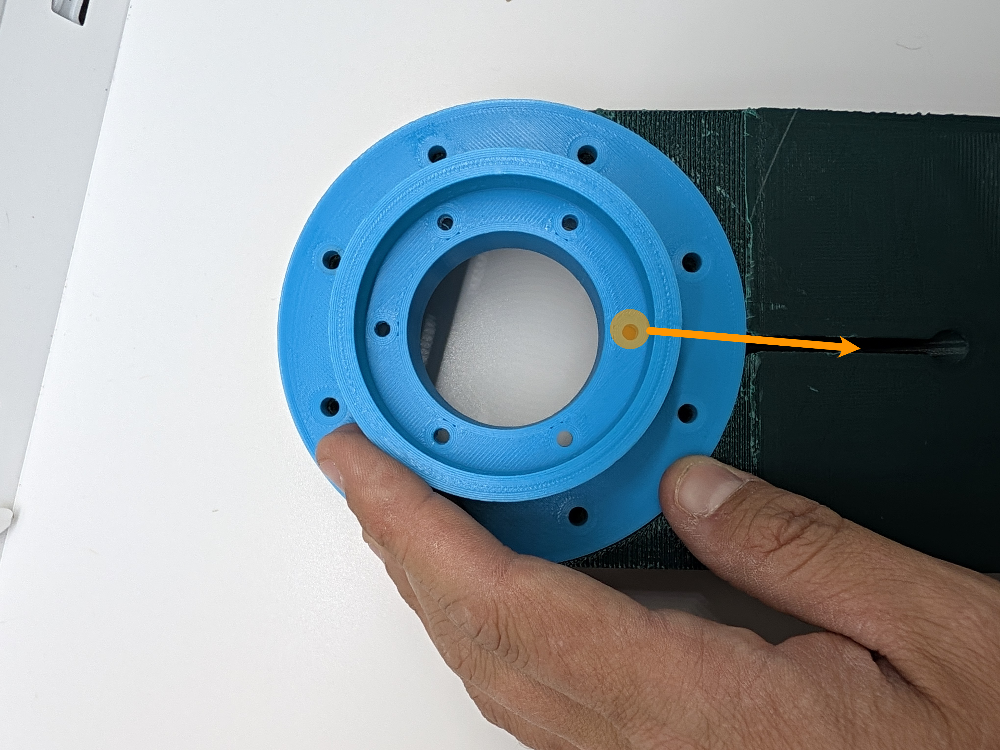

1. Place the two RobStride O0 motors into their respective motor support (torso_torso23 and torso_torso33). Secure each with six M3x8 screws.

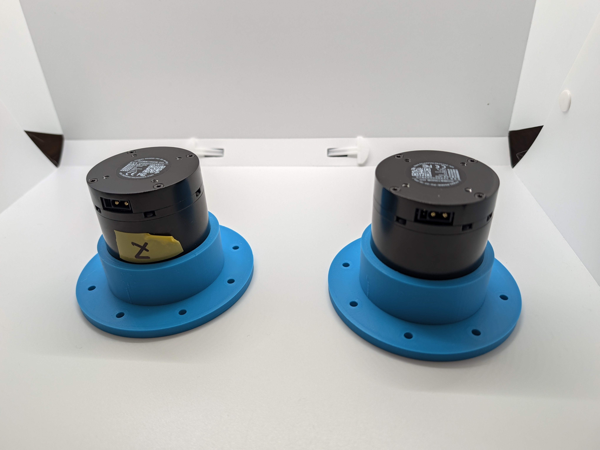

2. Insert two 35x72x17 bearings into the slots on torso_13.stl

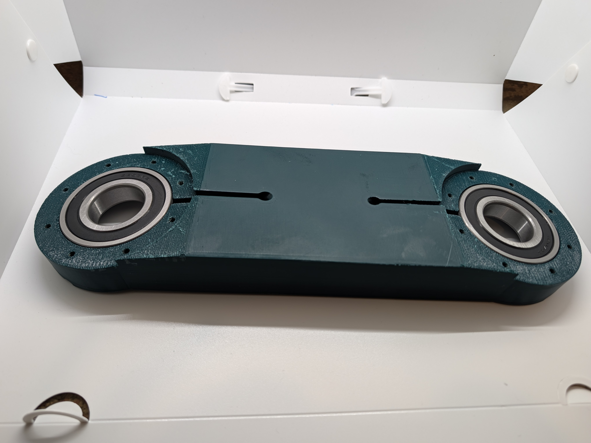

3. Place each motor-support subassembly on top of the bearing stack and secure them with eight M4x20 screws. At this stage ensure that the motor cables face inward.

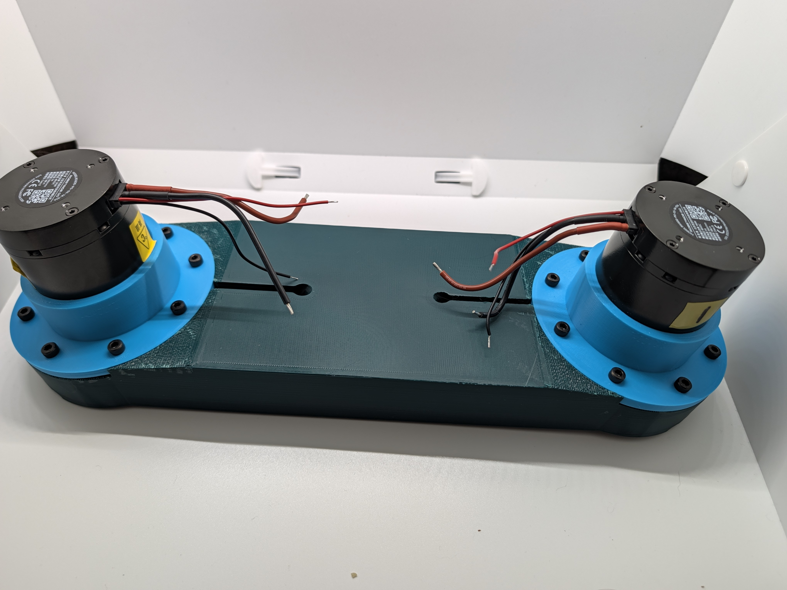

4. Verify both torso motor outputs rotate freely after tightening.

5. Attach the CAN bus holder to the bottom of the assembly. This will not be secured using screws, but the part on the buttom extending from the base will fit in the lower assembly's groove.

6. Place the CAN bus on the CAN bus holder and use torso_can_holder_2.stl to secure it into place with four M3x35 screws.

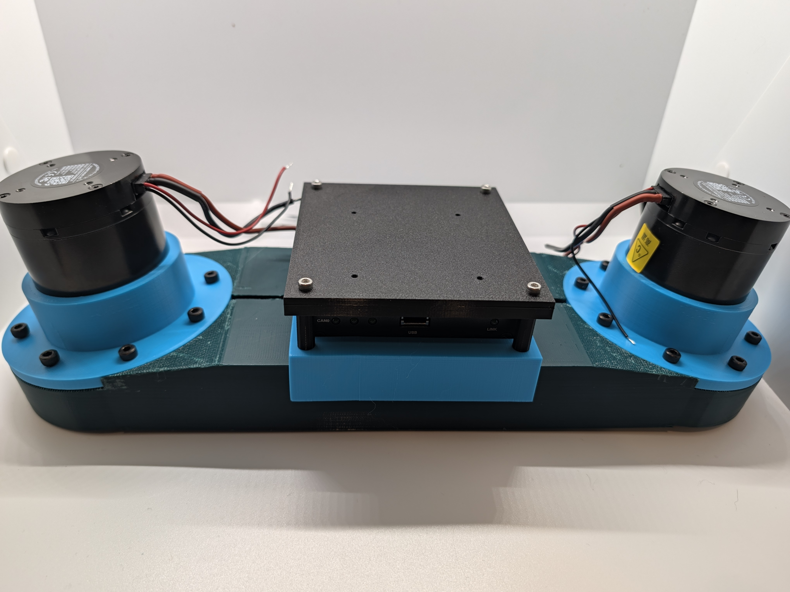

7. Use five M5x10 screws to connect torso_upper_torso_22 with torso_upper_torso_12. The two on the ends should be loosely inserted as they will be tightened in the next step.

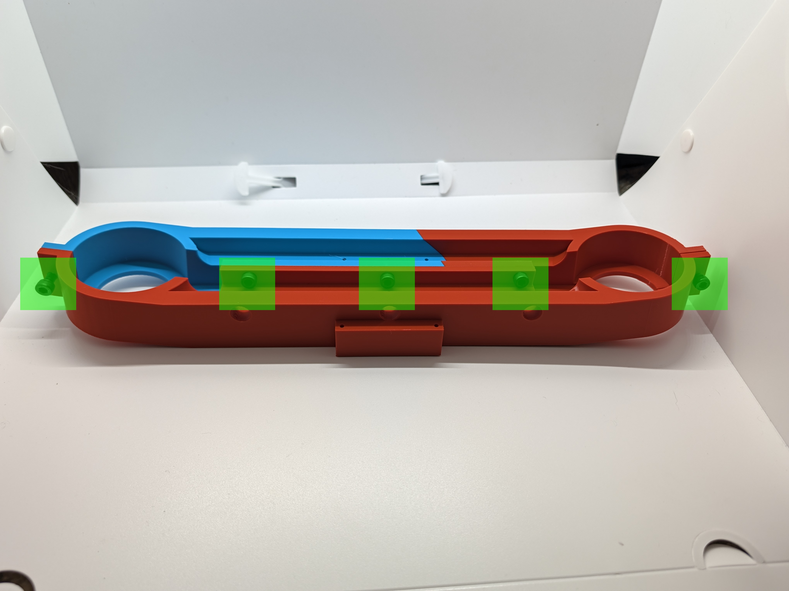

8. Place the upper assembly on to the lower assembly and tighten the screws at the end of the upper assembly.

9. Attach the Raspberry Pi with the IMU holder to the top of the upper assembly using four M2.5x20 screws. *Do not overtighten, as there's no extra space under the Raspberry Pi and you can damage the board*. Attach the IMU to the top of the IMU holder using four M2x5 screws. Pins on the IMU should be soldered so that the pins protrude from the 'front' of the board.

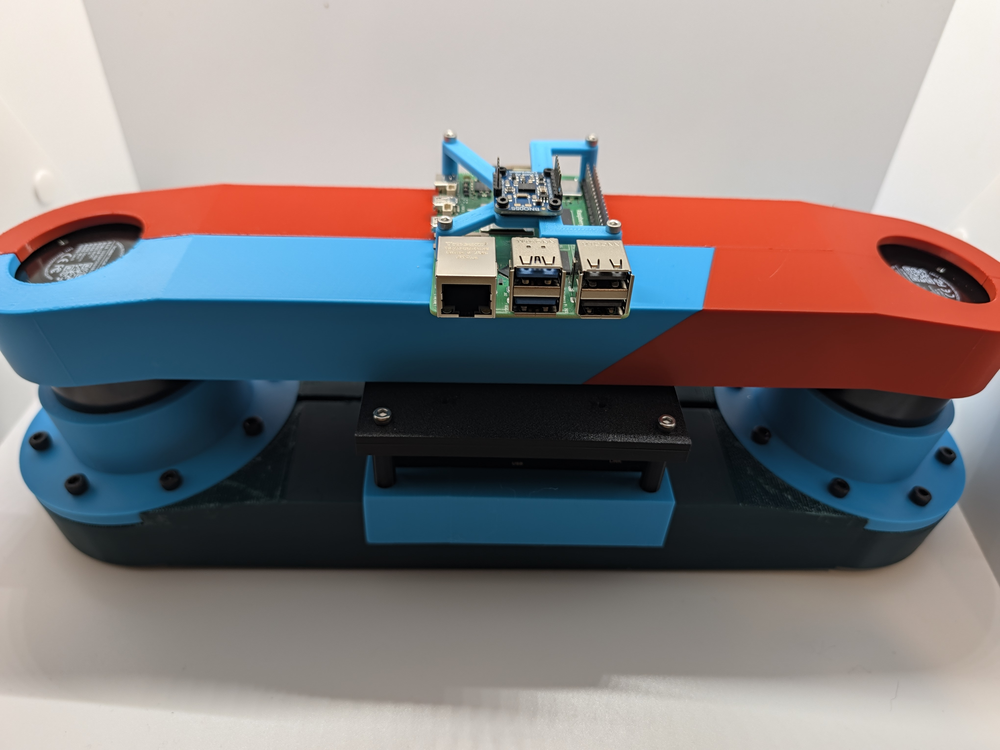

## Hips

Components:
| Category | Name | Specification | Qty / Subassembly | Qty / Robot |
|---|---|---|---:|---:|
| motor | RobStride O2 | actuator | 1 | 2 |
| bearing | Bearing | 35x72x17 | 2 | 4 |
| fastener_screw | M3 screw | M3 x 10 cyl head | 12 | 24 |
| fastener_screw | M4 screw | M4 x 12 cyl head | 6 | 12 |
| fastener_screw | M4 screw | M4 x 40 cyl head | 6 | 12 |
| fastener_screw | M4 screw | M4 x 45 cyl head | 4 | 8 |

STL To Print:
| Name | Quantity |
|---|---:|
| left_leg/hipz/hip_z_hipz12_sym.stl | 1 |
| left_leg/hipz/hip_z_hipz22_sym.stl | 1 |
| right_leg/hipz/hip_z_hipz12.stl | 1 |
| right_leg/hipz/hip_z_hipz22.stl | 1 |
| left_leg/hipx/hipx_2_hipxy_sym.stl | 1 |
| right_leg/hipx/hipx_2_hipxy.stl | 1 |

Assembly steps:
1. Insert the 35x72x17 bearings into hip_z_hipz22 and hip_z_hipz22_sym

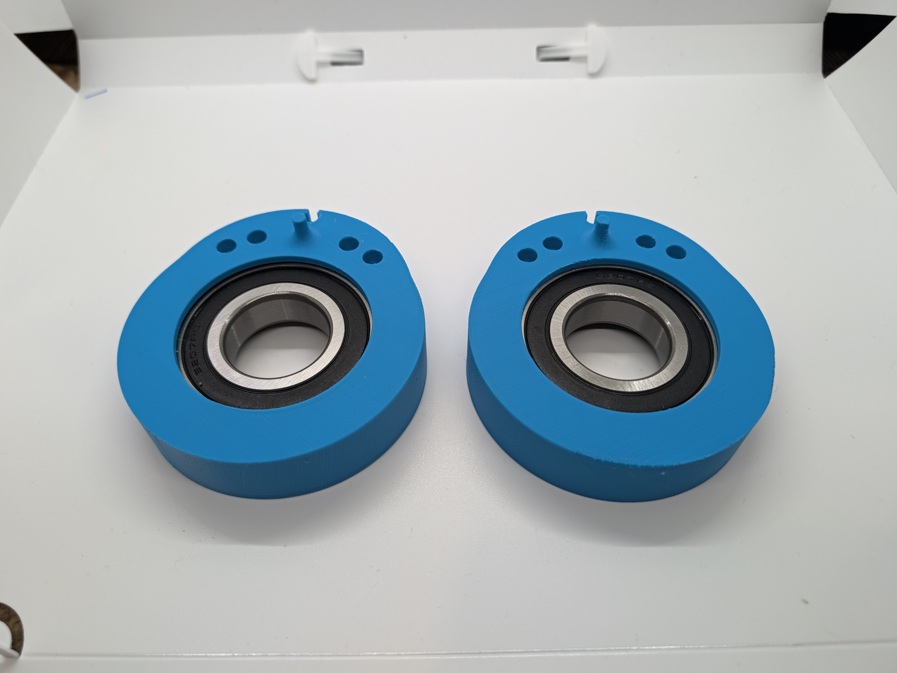

2. Insert the RobStride O2 motors into hip_z_hipz12 and hip_z_hipz12_sym. Double check which hip piece you are inserting your motors into. 

> Comment: It is difficult to rotate the entire motor body or remove the motor after insertion, so confirm hole alignment before setting.

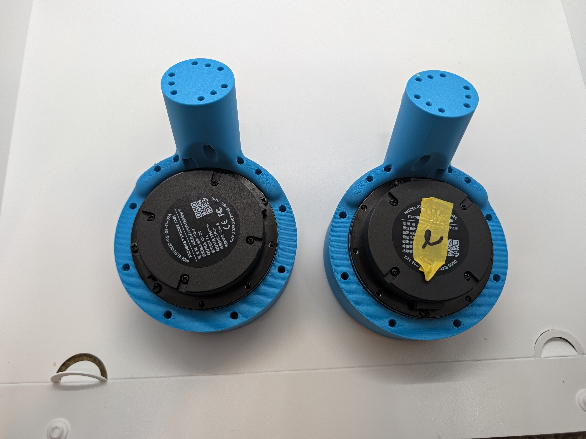

3. Use nine M3x10 screws to attach the RobStride O2 motor to hipz12 and hipz12_sym, respectively.

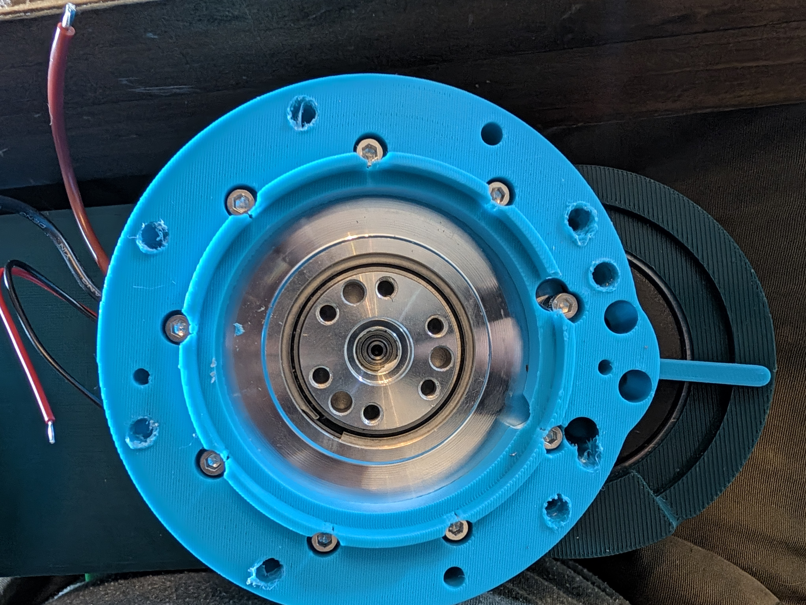

4. Attach hip_z_hipz12 and hip_z_hipz12_sym to motor 1 or 7, respectively, using three M3x10 screws and three pins. 

> Comment: You will need a longer hex key than what comes with most screw sets. I had success with a 13cm key.

> Comment: The hip pieces have spaces for six screws (also shown in the CAD file), but if the hip piece is attached to the torso without the motor in it, the motor cannot fit into place. If the motor is placed into the hip piece, three of the screw holes are covered. This is an open item for fixing in the future.

> Comment: The thin piece extending from hipz12 should sit to the side of a blocking piece on the torso track, preventing the hip from rotating 360 degrees.

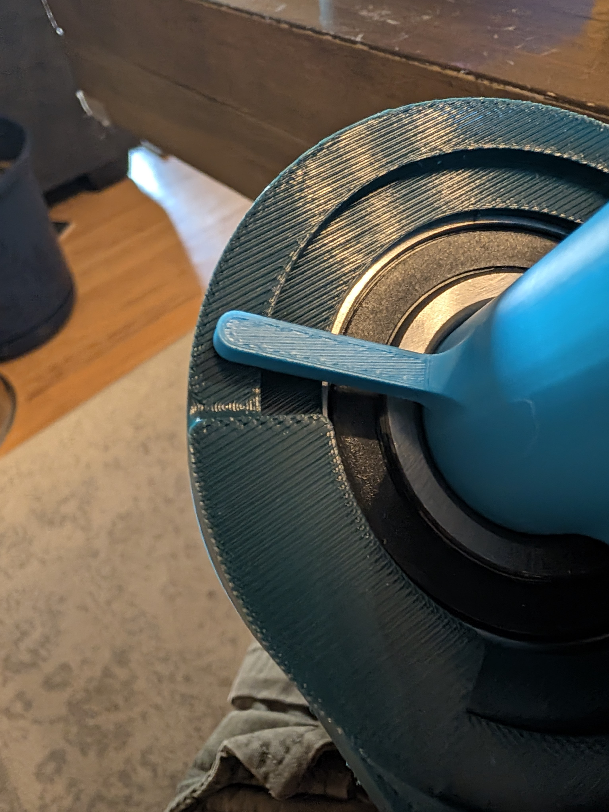

5. Route the hip pass-through sub-cable through hipz according to `hardware/electronics/cabling/README.md`.

6. Attach hipz22 and hipz22_sym to hipz12 and hipz12_sym. Use four M4x45 screws on the lower side and six M4x40 screws on the top side to attach them together.

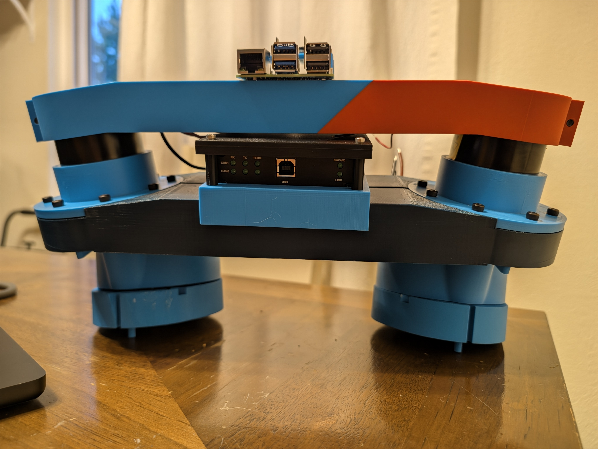

7. Insert hipx_2_hipxy and hipx_2_hipxy_sym into their respective points from the hip z assemblies that you just completed. Mount each to the RobStride O2 motor using six M4x12 screws.

8. Verify free motion. There may be a slight clicking from the long piece extending from hipz12/hipz12_sym and the notch on the bottom of the lower torso.

At this point you should have a completed upper for the legs robot.

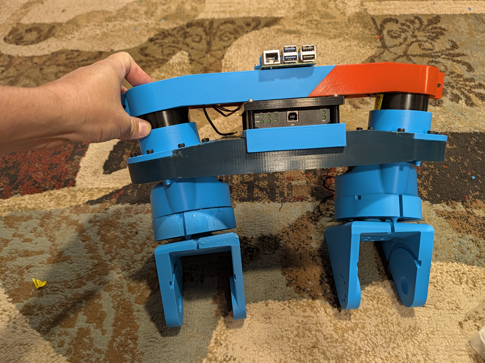

## thigh

Components:
| Category | Name | Specification | Qty / Subassembly | Qty / Robot |
|---|---|---|---:|---:|
| motor | RobStride O3 | actuator | 2 | 4 |
| bearing | Bearing | 15x21x4 | 1 | 2 |
| fastener_screw | M2.5 screw | M2.5 x 6 cyl head | 3 | 6 |
| fastener_screw | M4 screw | M4 x 10 cyl head | 12 | 24 |
| fastener_screw | M4 screw | M4 x 16 cyl head | 2 | 4 |
| fastener_screw | M4 screw | M4 x 20 cyl head | 6 | 12 |
| fastener_screw | M4 screw | M4 x 30 cyl head | 4 | 8 |

STL To Print:
| Name | Quantity |
|---|---:|
| left_leg/thigh/femur_v2_femur_12_sym_1.stl | 1 |
| left_leg/thigh/femur_v2_femur_22_sym_1.stl | 1 |
| left_leg/thigh/femur_hat_small_1.stl | 1 |
| right_leg/thigh/femur_v2_femur_12_1.stl | 1 |
| right_leg/thigh/femur_v2_femur_22_1.stl | 1 |
| right_leg/thigh/femur_hat_small_1.stl | 1 |

> Comment: The left leg follows the same instructions as the right, though uses the symetrical pieces. They can be built concurrently.

Assembly steps:
1. Insert one 15x21x4 bearing into the joint hole on `hipxy`.

> Comment: This is a difficult piece to insert. I applied WD-40 to the bearing slot and gently tapped it into position with the flat side of a hammer.

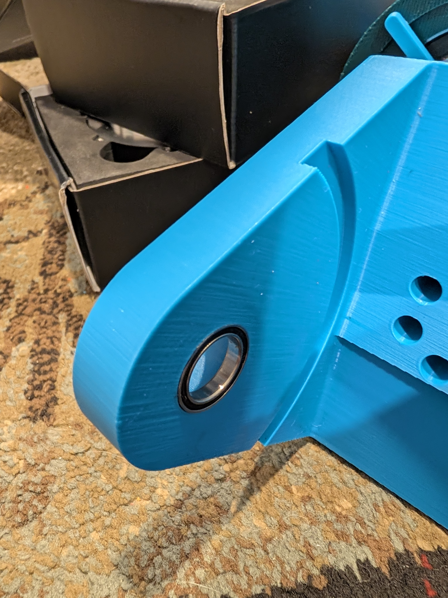

2. Insert `femur_22` into the bearing/hipxy.

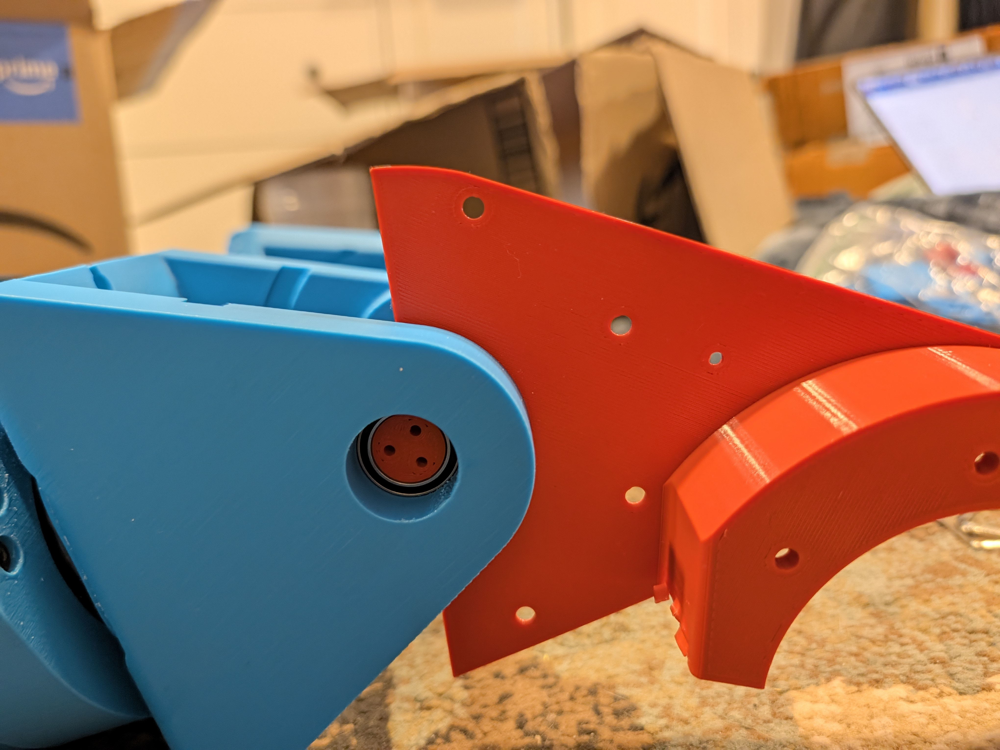

3. Using three M2.5 x 6 screws, attach ujoint_hat_small_1 to `femur_22` over the bearing to hold the piece in place.

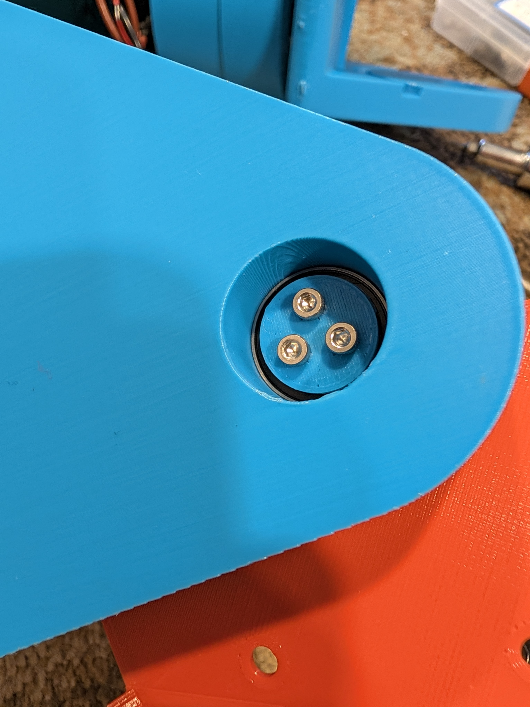

4. The RobStride O3 motors will be inserted in a way where half of the motor should have screws on the back side and the other half of the backside shouldn't have any screws. Remove two of the screws beside one of the data/power ports and insert them into the blank spaces on the other side of the motor. You can do this for all of the RobStride O3 motors used in this subassembly.

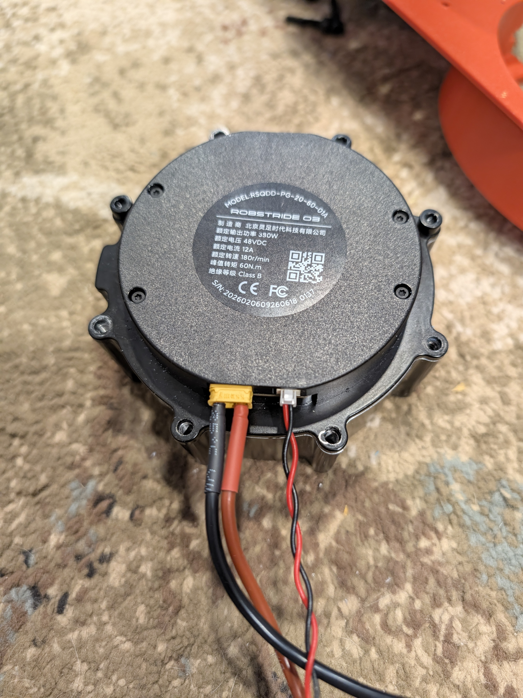

5. Push RobStride O3 ID 3 (or 9 on the left leg) into `femur_12`. Align the holes that do not have screws so they are aligned with the openings in `femur_12`. Secure it with four M4 x 10 screws.

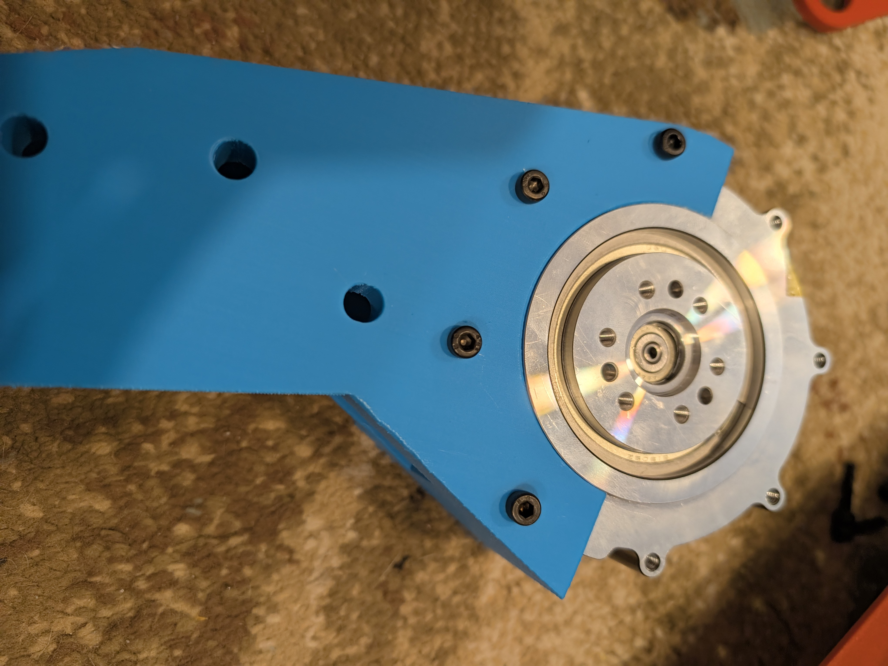

6. Attach `femur_12` to `hip_xy` using six M4 x 20 screws. `femur_22` should align with `femur_12` so that they fit flush together.

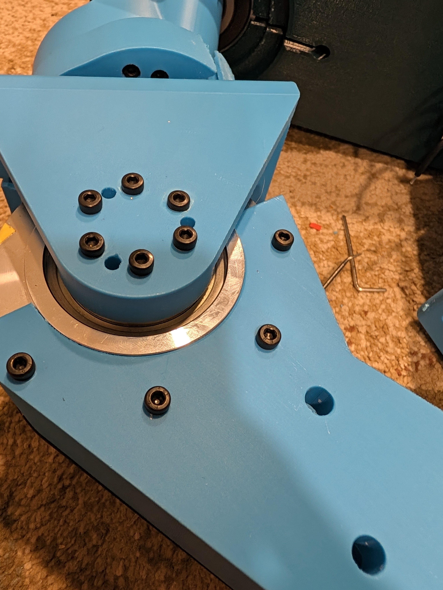

7. Install and route the thigh sub-cable before final closing (`hardware/electronics/cabling/README.md`).

> Comment: Since I don't have the wiring diagram at this point, I'm holding off on routing wires. Do what you think is best here. - Paul Ruiz

8. Attach `femur_12` to `femur_22` using four M4 x 30 screws near the top motor and two M4 x 16 motors at the lower portion.

> Comment: I found the lower holes to be pretty loose. I added two M4 threaded heat inserts on both legs to secure it better. Just be careful here as the femurs were the pieces that took the longest to print, so you don't want to ruin them this early.

9. Insert the second RobStride O3 motor (ID 4 or 10) into the femur. If you didn't adjust the screws on the back earlier, now is the time to do that. Mount the motor into place using eight M4 x 10 screws (four on both sides).

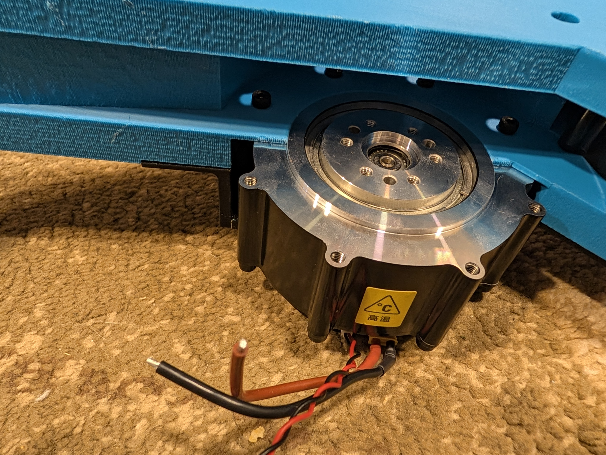

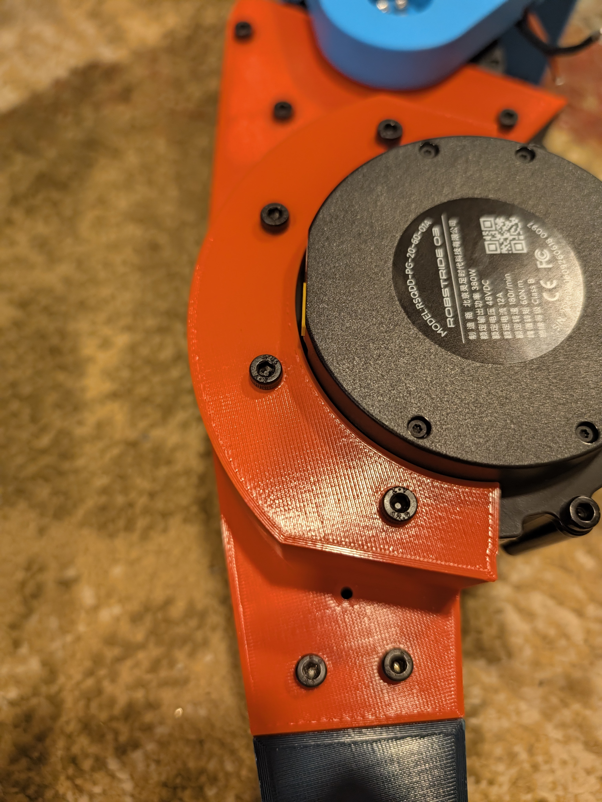

> Comment: Do not lock thigh with permanent pins if you want it demountable.

Assembly at this point:

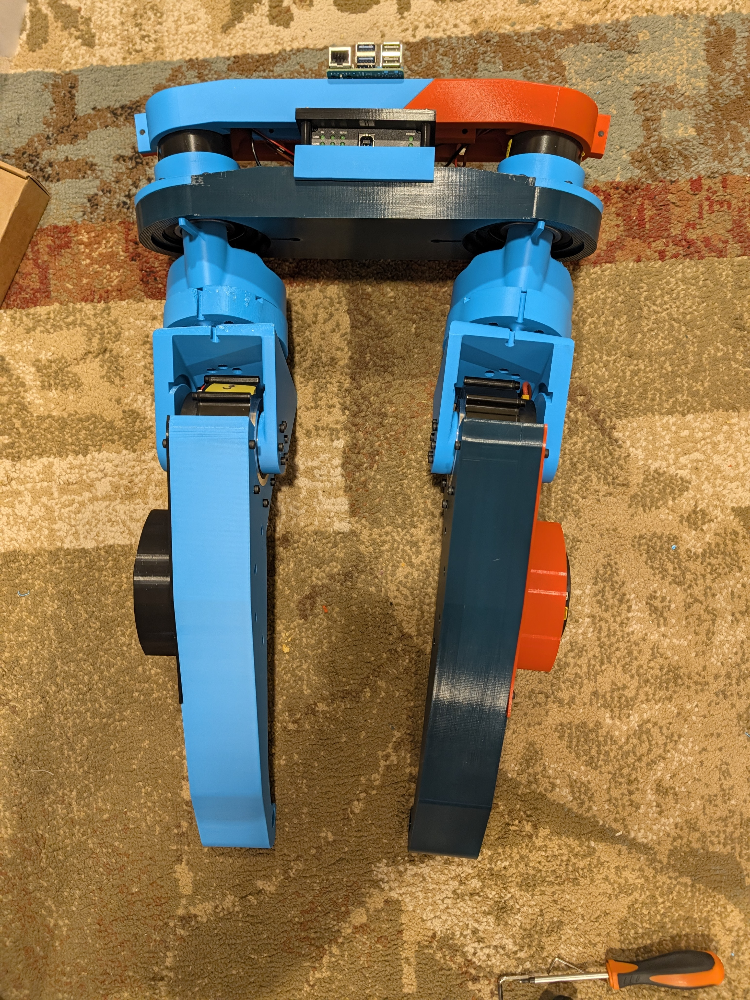

## Foot and Ankle

Components:
| Category | Name | Specification | Qty / Subassembly | Qty / Robot |
|---|---|---|---:|---:|
| bearing | Bearing | 5x16x5 | 2 | 4 |
| fastener_screw | M2.5 screw | M2.5 x 8 cyl head | 9 | 18 |
| fastener_axis | Shoulder screw 07534-05X20 | 2 | 4 |
| fastener_axis | Shoulder screw 07534-05X40| 1 | 2 |
| fastener_nut | Nut M4 | M4 nut | 3 | 6 |
| joint_spherical | Spherical joint 27628-01-05 | 2 | 4

STL To Print:
| Name | Quantity |
|---|---:|
| left_leg/foot/bearing_spacer14_5_7_3.stl | 1 |
| left_leg/foot/bearing_spacer24_5_7_3.stl | 1 |
| left_leg/foot/bearing_spacer34_5_7_3.stl | 1 |
| left_leg/foot/bearing_spacer44_5_7_3.stl | 1 |
| left_leg/ankle/ujoint_spacer_12_ujoint.stl | 1 |
| left_leg/ankle/ujoint_spacer_22_ujoint.stl | 1 |
| left_leg/ankle/ujoint_ujoint.stl | 1 |
| left_leg/foot/foot_foot.stl | 1 |
| left_leg/foot/foot_hat_small.stl | 1 |
| right_leg/foot/bearing_spacer14_5_7_3.stl | 1 |
| right_leg/foot/bearing_spacer24_5_7_3.stl | 1 |
| right_leg/foot/bearing_spacer34_5_7_3.stl | 1 |
| right_leg/foot/bearing_spacer44_5_7_3.stl | 1 |
| right_leg/foot/foot_foot.stl | 1 |
| right_leg/foot/foot_hat_small.stl | 1 |
| right_leg/ankle/ujoint_spacer_12_ujoint.stl | 1 |
| right_leg/ankle/ujoint_spacer_22_ujoint.stl | 1 |
| right_leg/ankle/ujoint_ujoint.stl | 1 |

Assembly steps:

> Comment: You will follow these same steps for both feet.

1. Attach two spherical joints between the notches at the front of the foot and secure into place using two 5x20 shoulder screws. When inserting the shoulder screw, place a 5x6x3 spacer on both side of the spherical joints. Secure shoulder screw with an M4 nut.

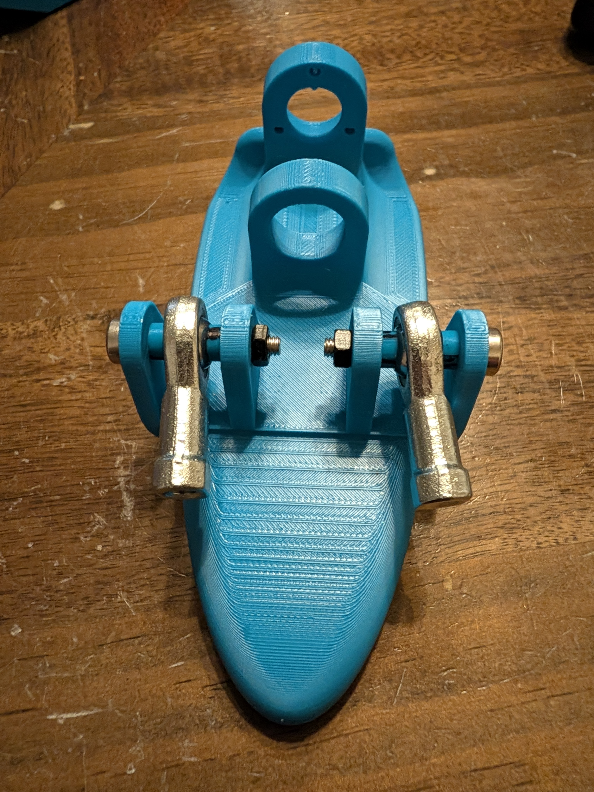

2. Place two 5x16x5 bearings into the grooves at the back of the foot. Apply firm even pressure to seat them.

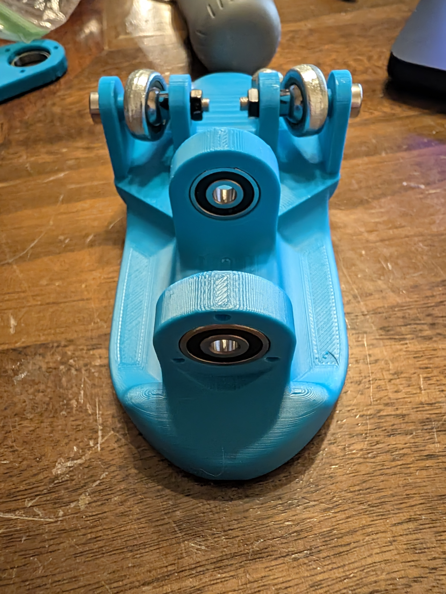

3. Place the u-joint between the back bearings with a u-joint spacer on both sides of the ujoint. Secure into place using a 5x40 shoulder screw and M4 nut. Attach the foot_hat_small piece over the back bearing and secure in place using three M2.5x8 screws.

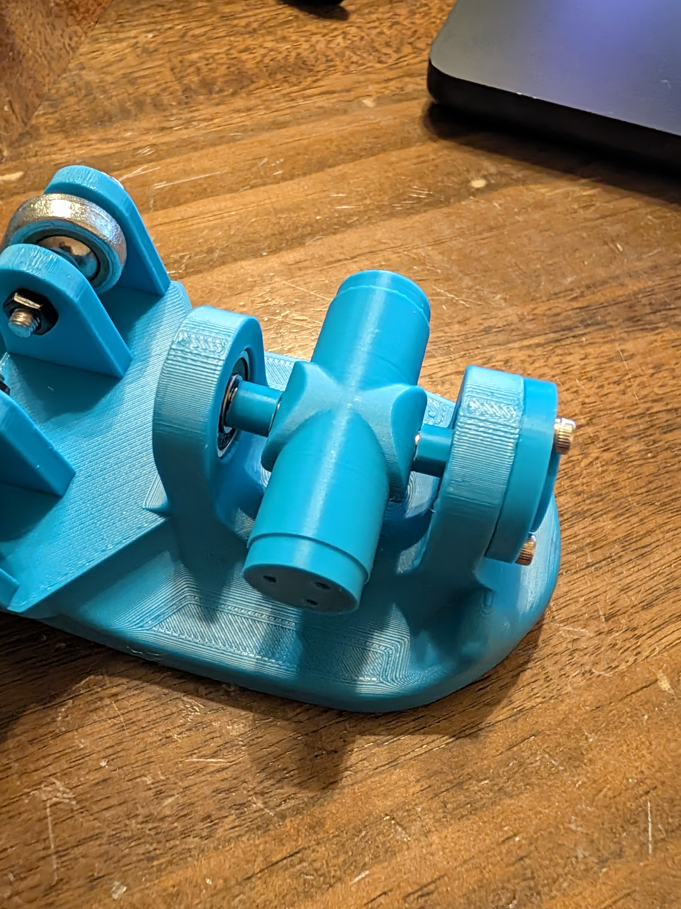

4. Verify free ankle motion after tightening.

## knee_mechanism

Components:
| Category | Name | Specification | Qty / Subassembly | Qty / Robot |
|---|---|---|---:|---:|
| bearing | Bearing | 15x21x4 | 2 | 4 |
| fastener_screw | M3 screw | M3 x 18 cyl head | 3 | 6 |

STL To Print:
| Name | Quantity |
|---|---:|
| left_leg/knee_mechanism/femur_v2_knee_actuation_2.stl | 1 |
| left_leg/knee_mechanism/femur_v2_knee_rod12_sym_1.stl | 1 |
| left_leg/knee_mechanism/femur_v2_knee_rod22_sym_1.stl | 1 |
| right_leg/knee_mechanism/femur_v2_knee_actuation_1.stl | 1 |
| right_leg/knee_mechanism/femur_v2_knee_rod12_1.stl | 1 |
| right_leg/knee_mechanism/femur_v2_knee_rod22_1.stl | 1 |

Assembly steps:
1. Place a 15x21x4 bearing on either side of the knee actuator.

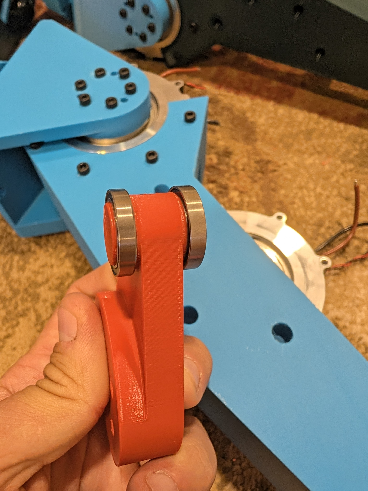

2. Attach knee_rod12 and knee_rod22 to the knee actuator, then align and secure with three M3x18 screws

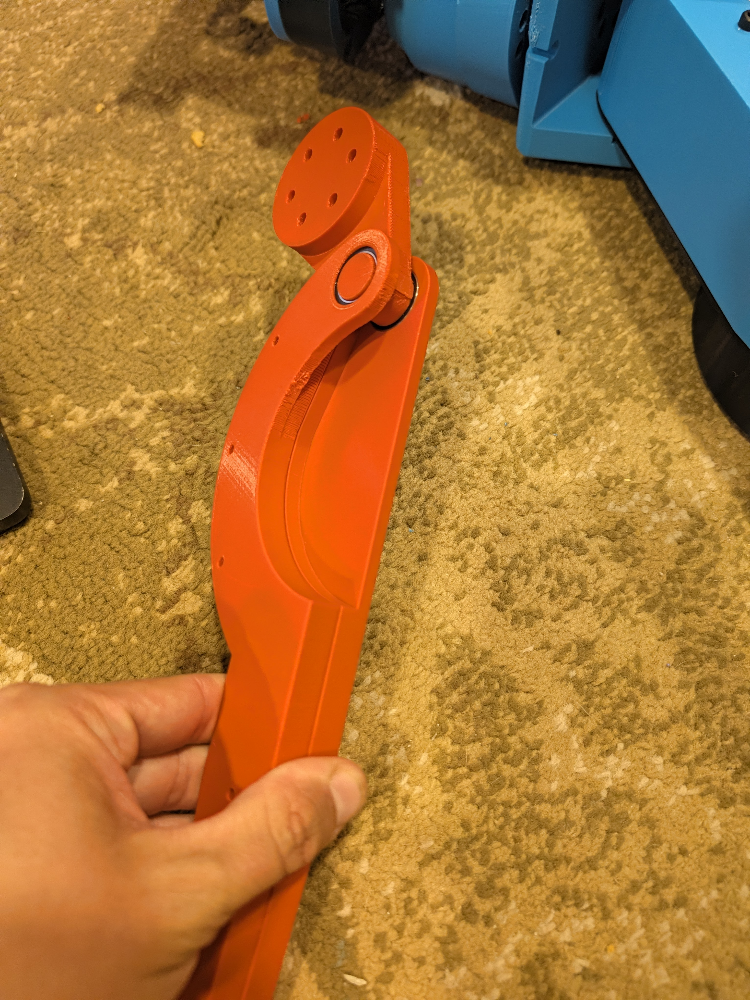

3. Set this subassembly aside, as it will be used at the end of the next step.

## shin

Components:
| Category | Name | Specification | Qty / Subassembly | Qty / Robot |
|---|---|---|---:|---:|
| motor | RobStride O5 | actuator | 2 | 4 |
| bearing | Bearing | 15x21x4 | 4 | 8 |
| fastener_screw | M2.5 screw | M2.5 x 8 cyl head | 3 | 6 |
| fastener_screw | M3 screw | M3 x 17.5 cyl head | 4 | 8 |
| fastener_screw | M3 screw | M3 x 10 cyl head | 24 | 48 |
| fastener_screw | M4 screw | M4 x 18 cyl head | 16 | 32 |
| fastener_screw | M4 screw | M4 x 10 cyl head | 9 | 18 |
| fastener_nut | Nut M4 | M4 nut | 3 | 6 |
| fastener_insert | Heat-set insert M3 | brass threaded insert M3 | 4 | 8 |

STL To Print:
| Name | Quantity |
|---|---:|
| left_leg/shin/spacer12_5_9_4_5.stl | 1 |
| left_leg/shin/spacer22_5_9_4_5.stl | 1 |
| left_leg/shin/tibias2_hat_big.stl | 1 |
| left_leg/shin/tibias2_shin_spacer_2.stl | 1 |
| left_leg/shin/tibias2_tibias12_sym_4.stl | 1 |
| left_leg/shin/tibias2_tibias22_sym_4.stl | 1 |
| left_leg/thigh/femur_v2_hat_femur_2.stl | 1 |
| left_leg/ankle/ujoint_hat_small_12.stl | 1 |
| left_leg/ankle/ujoint_hat_small_22.stl | 1 |
| right_leg/shin/spacer12_5_9_4_5.stl | 1 |
| right_leg/shin/spacer22_5_9_4_5.stl | 1 |
| right_leg/shin/tibias2_hat_big.stl | 1 |
| right_leg/shin/tibias2_shin_spacer_2.stl | 1 |
| right_leg/shin/tibias2_tibias12.stl | 1 |
| right_leg/shin/tibias2_tibias22.stl | 1 |
| right_leg/thigh/femur_v2_hat_femur_2.stl | 1 |
| right_leg/ankle/ujoint_hat_small_12.stl | 1 |
| right_leg/ankle/ujoint_hat_small_22.stl | 1 |

Assembly steps:
1. Install M3 inserts first (`4` per shin).
2. Insert bearings and pins/goupilles.
3. Mandatory: place the full knee mechanism (including motor) inside before final shin closure.
4. For re-assembly in tight fit conditions: gently shift the bearing with light hammer taps to create spacer clearance, insert spacer, then re-seat bearing.
5. Install and route the shin sub-cable before closure (`hardware/electronics/cabling/README.md`).
6. Preferable: place ankle module now (recommended, not mandatory).
7. Close and screw shin structure, then verify internal parts still move.

## ankle_mechanism

Components:
| Category | Name | Specification | Qty / Subassembly | Qty / Robot |
|---|---|---|---:|---:|
| fastener_screw | M5 screw | M5 x 15 cyl head | 4 | 8 |
| joint_spherical | Spherical joint 27628-01-05 | Norelem | 4 | 8 |
| fastener_axis | Shoulder screw 07534-05X20 | ISO7379, D1=5, L1=20, B=8, M4, steel 12.9 | 4 | 8 |
| bearing | Bearing | 5x16x5 | 2 | 4 |

STL To Print:
| Name | Quantity |
|---|---:|
| left_leg/ankle_mechanism/bearing_spacer14_5_7_3.stl | 1 |
| left_leg/ankle_mechanism/bearing_spacer24_5_7_3.stl | 1 |
| left_leg/ankle_mechanism/bearing_spacer34_5_7_3.stl | 1 |
| left_leg/ankle_mechanism/bearing_spacer44_5_7_3.stl | 1 |
| left_leg/ankle_mechanism/tibias2_rod_long.stl | 1 |
| left_leg/ankle_mechanism/tibias2_rod_small.stl | 1 |
| left_leg/ankle_mechanism/tibias_actuation_ankle_12.stl | 1 |
| left_leg/ankle_mechanism/tibias_actuation_ankle_22.stl | 1 |
| right_leg/ankle_mechanism/bearing_spacer14_5_7_3.stl | 1 |
| right_leg/ankle_mechanism/bearing_spacer24_5_7_3.stl | 1 |
| right_leg/ankle_mechanism/bearing_spacer34_5_7_3.stl | 1 |
| right_leg/ankle_mechanism/bearing_spacer44_5_7_3.stl | 1 |
| right_leg/ankle_mechanism/tibias2_rod_long.stl | 1 |
| right_leg/ankle_mechanism/tibias2_rod_small.stl | 1 |
| right_leg/ankle_mechanism/tibias_actuation_ankle_12.stl | 1 |
| right_leg/ankle_mechanism/tibias_actuation_ankle_22.stl | 1 |

Assembly steps:
1. Install spherical joints on rods (`2` per rod, `4` per leg, `8` per robot).
2. Assemble rods, spacers, and ankle actuation parts, then screw.
3. Verify mechanism moves freely through its range.
