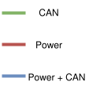
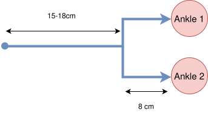
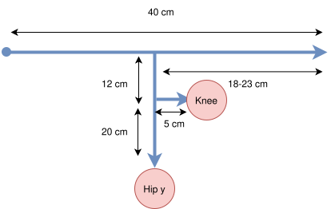
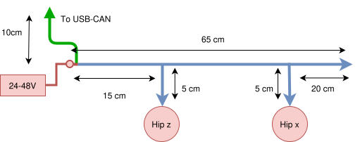

# Leg Cabling Diagrams

This folder contains the leg sub-cable diagrams used on the robot.

The same cabling architecture is used for both left and right legs.
The split by `shin` / `thigh` / `hip` is intentional to simplify debugging and repair.

## Legend

`red = power`, `green = CAN`, `blue = CAN + power`

## Shin sub-cable

## Thigh sub-cable

## Hip pass-through sub-cable

