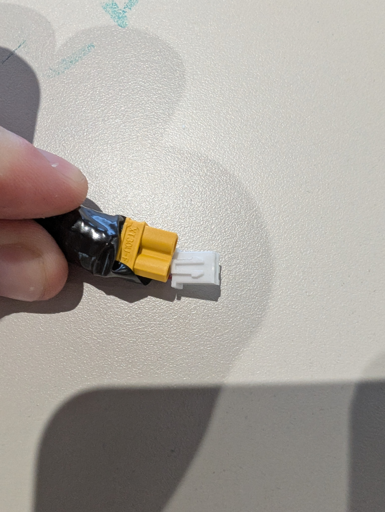
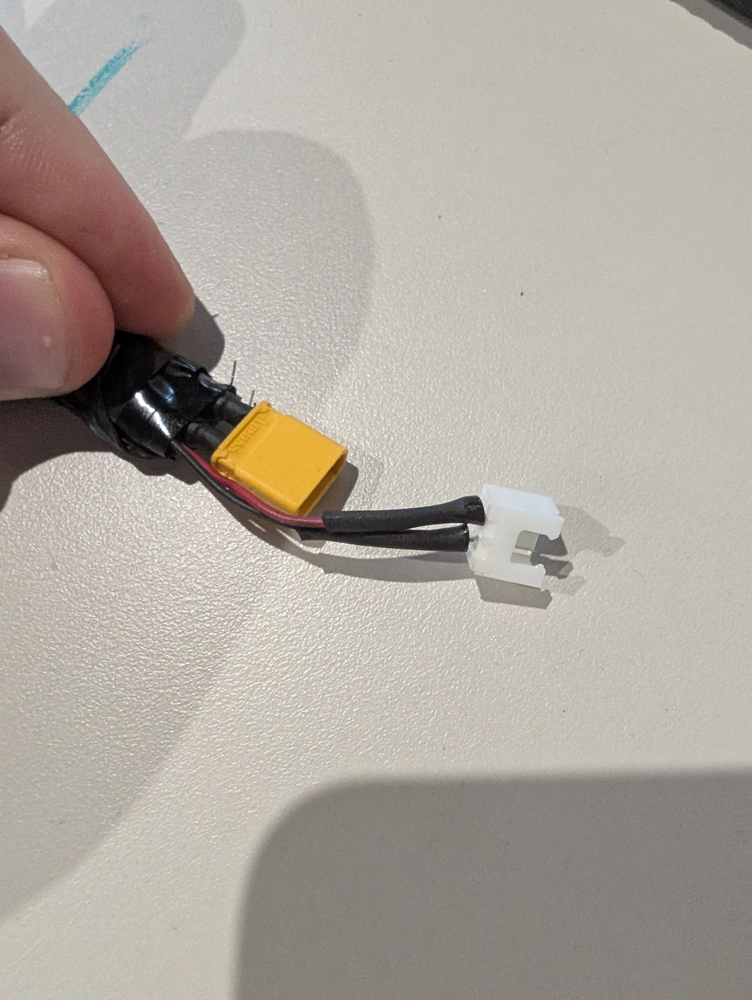
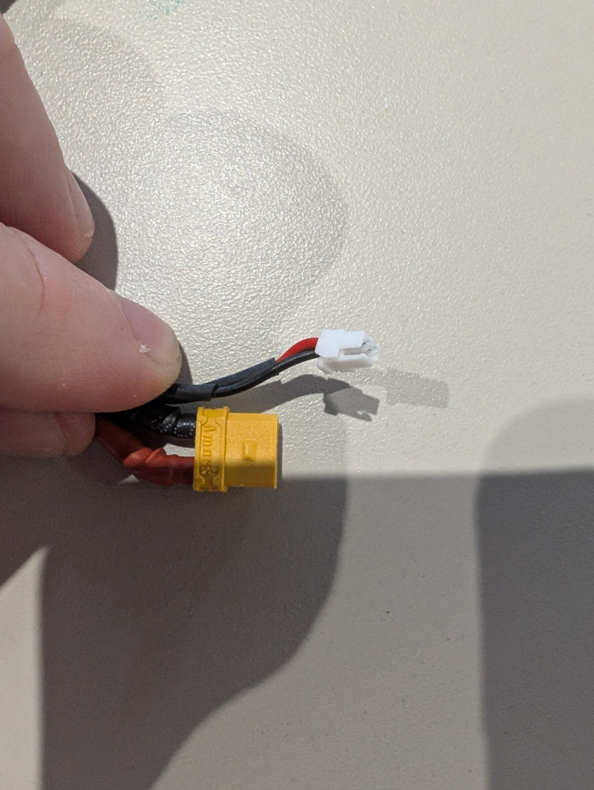
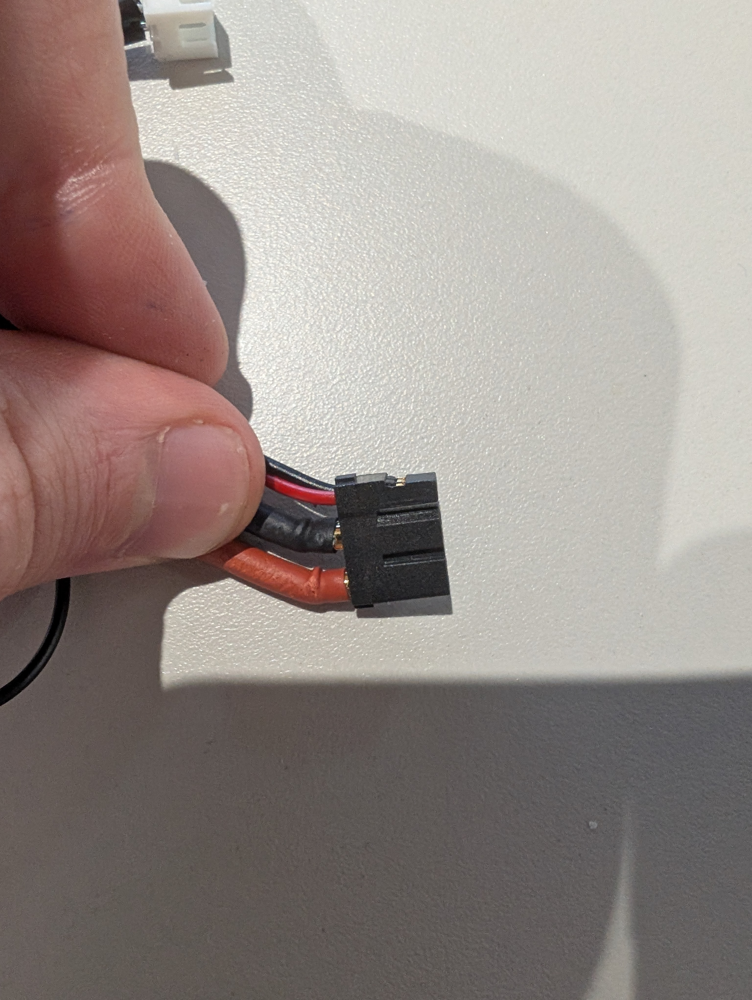

# Connectors

## Visual connector catalog (used on this robot)

### Inter-cable connector (male)

### Inter-cable connector (female)

### RobStride O3-side connector

### RobStride connector (other RobStride models used here)

### XT30 power connector

XT30 is used to connect to the power source.  
XT30 is visible on the connector photos above (yellow power connector body).

## Connector map (biped platform)

| Connector ID | Function | Board Side | Device Side | Pinout Status | Notes |
|---|---|---|---|---|---|
| CONN-CANFD-ADAPTER-01 | USB to dual CAN-FD interface | USB-A host | USB-A plug | defined | SAVVYCANFD 2CH CANFD adapter |
| CONN-CANFD-CH0-DB9 | CAN channel 0 (torso/left bus split as needed) | DB9 female on adapter (`CAN0`) | DB9 harness | partial | Known pins: `2=CAN-L`, `3=GND`, `7=CAN-H` |
| CONN-CANFD-CH1-DB9 | CAN channel 1 (torso/right bus split as needed) | DB9 female on adapter (`CAN1`) | DB9 harness | partial | Known pins: `2=CAN-L`, `3=GND`, `7=CAN-H` |
| CONN-PWR-01 | Main power in | XT30 pair | XT30 pair | partial | Main robot power entry |
| CONN-LEG-LINK-01 | Leg sub-cable interconnect | male inter-cable connector | female inter-cable connector | partial | Used between shin/thigh/hip cable subgroups |
| CONN-MOTOR-O3-01 | Motor-side connector for RobStride O3 | harness side `RSo3_connector` | motor side | partial | Use the O3-specific connector shown above |
| CONN-MOTOR-RS-OTHER-01 | Motor-side connector for other RobStride models used here | harness side `robstride_connector` | motor side | partial | Use the non-O3 RobStride connector shown above |

## To complete

- Commercial references used here:
  - XT30 for main power connection.
  - XH-2A / XH-2Y for inter-cable connection.
- Pin-level documentation policy for motor harnesses:
  - keep only the required signals in docs: `PWR+`, `PWR-`, `CAN-H`, `CAN-L`.
- Power wiring target:
  - size power lines for up to `30 A` per cable branch.
- CAN termination:
  - keep standard `120 ohm` termination at both bus ends.
  - bus-end termination is currently handled by the USB-CAN adapter side in this setup.
